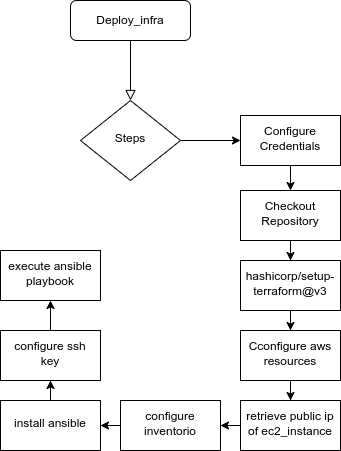

>  This is a challenge by [Coodesh](https://coodesh.com/)

# Coodesh - DevOps/SRE (Pleno) - Implantação de Infraestrutura

## Descrição

Este projeto contém arquivos para: 

- implantação de uma instância no EC2 (AWS)
- Configuração e criação de Dashboard de monitoramento utilizando Terraform
- Configuração de grupos de segurança para acesso via SSH e acesso da aplicação instalada
- Configuração de Cloudwatch Agent em instância EC2
- Instalação de serviço nginx em EC2
- Configuração e implantação de plano de backup para instância EC2 que possuem a tag com marcação **Backup** = **True** para ser realizado em todo dia útil as 02:00AM
- Pipeline para implantação de infraestrutura e configurações utilizadas no projeto\*

\* *Necessário fazer alguns ajustes no parâmetros do terraform e chaves SSH*

### Tecnologias utilizadas

- Ansible
- Terraform
- AWS
- Github Actions

## Setup

- Clonar repositório
- Configurar os seguintes secrets do GITHUB Actions:
  -  **SSH_PUB_KEY**: Chave pública do SSH, utilizada para permitir o acesso à máquina criada no EC2
  -  **SSH_KEY**: Chave privada do SSH, utilizada para permitir que o ansible acesse a máquina criada
  -  **AWS_SECRET_ACCESS_KEY**: código criado pelo IAM do AWS para permitir o acesso programático aos recursos da AWS
  -  **AWS_ACCESS_KEY_ID**: Identificação da chave criada
  -  **AWS_AMI**: AMI da instância que será criada, importante colocar uma máquina que seja Ubuntu 22.04 LTS, as AMI mudam de acordo com cada região que é executada.
  -  **AWS_SUBNET_ID**:
  -  **AWS_VPC_ID**:
  

- Definir as seguintes variáveis ao pipeline:
    -  **AWS_REGION**: Região que o ambiente será executado.
        
            É importante lembrar que a SUBNET_ID e o VPC_ID variam de acordo com a região que será utilizada.

 - Criar Bucket no S3 para armazenar arquivo de estados:
   - Nome: **s3-coodesh** 
   - Região: **us-east-1**
    *Caso queira alterar o nome do bucket e região alterar diretamente no arquivo **infra/providers.tf***
  
Estas configurações serão utilizados para criação do pipeline e configuração de todo o ambiente na AWS.

> Para geração das chaves SSH basta seguir os seguintes passos, abra um terminal:
>> No Linux e macOS, use o atalho usual (geralmente Ctrl+Alt+T) ou a ferramenta de busca do sistema.
>> No Windows, se você não tiver um terminal instalado, recomendo o Git Bash. Você pode instalá-lo gratuitamente em https://git-scm.com/downloads.
>>Execute o comando ssh-keygen:
>>>```bash
>>>ssh-keygen
>>>```
>> Serão feitas algumas perguntas relativas ao caminho onde salvar as chaves, com isso será gerado dois arquivos. Abra cada um deles com um editor de texto e copie o conteúdo de cada um deles para o correpondente secret no github.

* Criação de IAM User para acesso à AWS
  
       Nessário observar que o usuário deve ter permissões para acesso aos recursos utilizadas, evitar de colocar uma política permissiva, que permita a alteração de recursos indevidos.

## Pipeline

O pipeline foi criado da seguinte forma:




